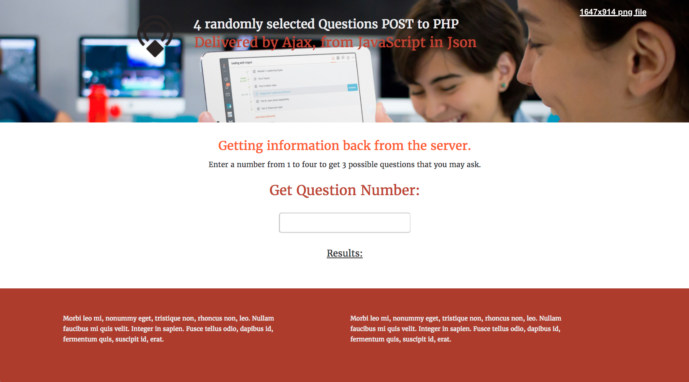

### <kbd>customerSurvey &nbsp; :rocket:</kbd> 
  Not finished     
  
  An inline event (key up) invokes a function that through ajax makes a call to a local php server file,      
  in order to get some data back from it.     
  - for example: if i enter a number from 1 thru four       
    - i'll get 3 possible outcomes (or questions) in return from the server       
  
        - <kbd>press 1</kbd>       
            **question a** 'what's your name'        
            **question b** 'what your favorite website'       
            **question c** 'what's your favorite blog'        
            
        - <kbd>press 2</kbd>        
            to get a different set of questions back        
  

> you need xampp 

 

### <kbd>To run/install :key:</kbd> 
<kbd>1</kbd> git clone repo :moyai:&nbsp;
<kbd>2</kbd> npm install :fuelpump:&nbsp;
<kbd>3</kbd> bower install :izakaya_lantern: &nbsp;
<kbd>4</kbd> bundler :construction:&nbsp;&nbsp;
<kbd>5</kbd> type grunt  &nbsp;&nbsp;:checkered_flag:

  
 
  
<kbd>not finished</kbd> 

